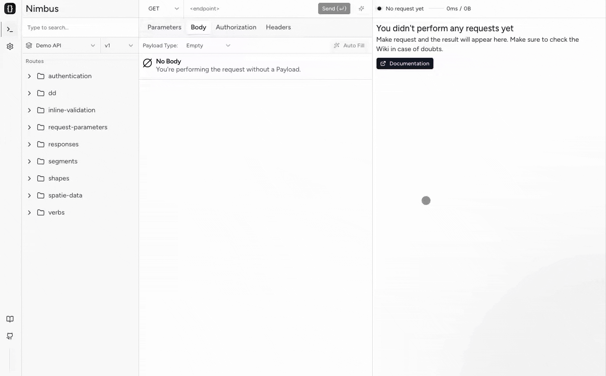

# Nimbus


[](https://packagist.org/packages/sunchayn/nimbus)
[](https://packagist.org/packages/sunchayn/nimbus)
[](https://packagist.org/packages/sunchayn/nimbus)
[](https://codecov.io/github/sunchayn/nimbus)

**An integrated, in-browser API client for Laravel with a touch of magic.**  
Nimbus automatically analyzes your application's routes and validation rules to provide an interactive API platform directly in the browser for testing and exploring your API endpoints.



---

## Why Nimbus?

Traditional API testing tools require manual setup for every endpoint. Nimbus removes that friction by automatically discovering your Laravel routes, generating schemas from validation rules, and handling authentication, cookies, and test data. All without leaving your development environment.

## What Nimbus Is NOT

Nimbus is **NOT** an API documentation generator like Swagger or Scribe. It doesn't produce customer-facing API documentation. Instead, it's a **developer-focused API playground** designed to improve your iteration speed while building and testing APIs.

## Key Features

- **Authentication Injection**: Seamlessly switch between special modes like current session auth, user impersonation by ID, or standard modes like Bearer and Basic credentials.
- **Cookie Decryption**: Inspect and automatically decrypt cookies to streamline debugging.
- **Shared Request Contexts**: Capture a request state (headers, body, auth) and share with colleagues.
- **Database Transaction Rollback**: Execute potentially destructive requests (DELETE, UPDATE) within a database transaction that automatically rolls back upon termination.
- **Integrated dd() Handling**: Intercepts native `dd()` calls and renders them in a dedicated, paginated debug viewer without disrupting the UI or response state.
- **Payload Autofill**: One-click payload population with realistic test data.
- **On-Demand Value Generators**: Inline value generators (UUIDs, names, emails, timestamps) within the request builder input fields.
- **Persistent Request History**: Every request is logged in a searchable history, allowing for full restoration of the interface state to any previous point in time.
- **Multi-Application Support**: Manage and toggle between multiple APIs (e.g., REST, Admin, or separate microservices) within a single unified dashboard.

### Technical Discovery

#### Automated Route Analysis
Nimbus performs static analysis of your application's routing layer to discover endpoints and their corresponding validation logic. This includes support for:
*   Standard Laravel `FormRequest` validation
*   `Spatie\LaravelData` DTOs
*   Inline controller validation logic

#### OpenAPI Specification Support
For projects with formal documentation, Nimbus can consume OpenAPI (YAML/JSON) specifications. This extends the discovery process by merging documented external specs with Nimbus's internal route detection.

---

## Installation

### 1. Requirements
*   PHP 8.2+
*   Laravel 10.x, 11.x, 12.x, or 13.x

### 2. Composer Install
```bash
composer require sunchayn/nimbus
```

### 3. Publishing Assets
```bash
php artisan vendor:publish --tag=nimbus-assets --tag=nimbus-config
```

### 4. Access
Start your Laravel application and navigate to:

```
http://your-app.test/nimbus
```

That's it! Nimbus will automatically discover your API routes and their validation schemas.

> [!NOTE]
> **Single-Threaded Server Environments**
> When using `php artisan serve` or Laravel Sail, concurrent relay requests may lead to timeouts due to PHP's single-threaded nature.
> Refer to the [Single-Threaded Guide](wiki/user-guide/README.md#making-nimbus-work-with-single-threaded-servers) for the recommended workaround.

## Documentation

*   **[User Guide](wiki/user-guide/README.md)**: Comprehensive interface walkthrough and troubleshooting.
*   **[Contributor Guide](wiki/contribution-guide/README.md)**: Architecture overview and local development instructions.

## Security Considerations
- **Development Only**: Nimbus is designed for local development environments. Do not deploy it to production servers.
- **User Impersonation**: The impersonation feature allows making requests as any user. Ensure Nimbus is only accessible in trusted development environments.

## Release Status

Nimbus is currently an **Alpha**. You may encounter unexpected behaviors or bugs, all feedback is welcome:
- Report bugs: [Open an issue](https://github.com/sunchayn/nimbus/issues/new/choose)
- Share ideas: [Start a discussion](https://github.com/sunchayn/nimbus/discussions/categories/ideas)
- Ask questions: [Q&A discussions](https://github.com/sunchayn/nimbus/discussions/categories/q-a)

## License

Nimbus is open-source software licensed under the [MIT license](LICENSE.md).
