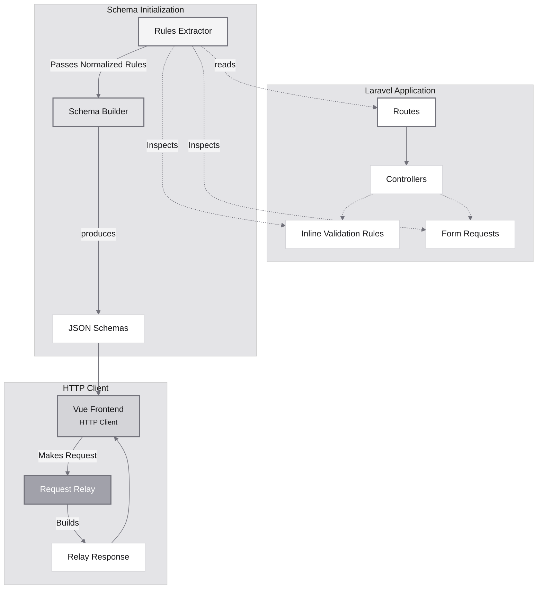
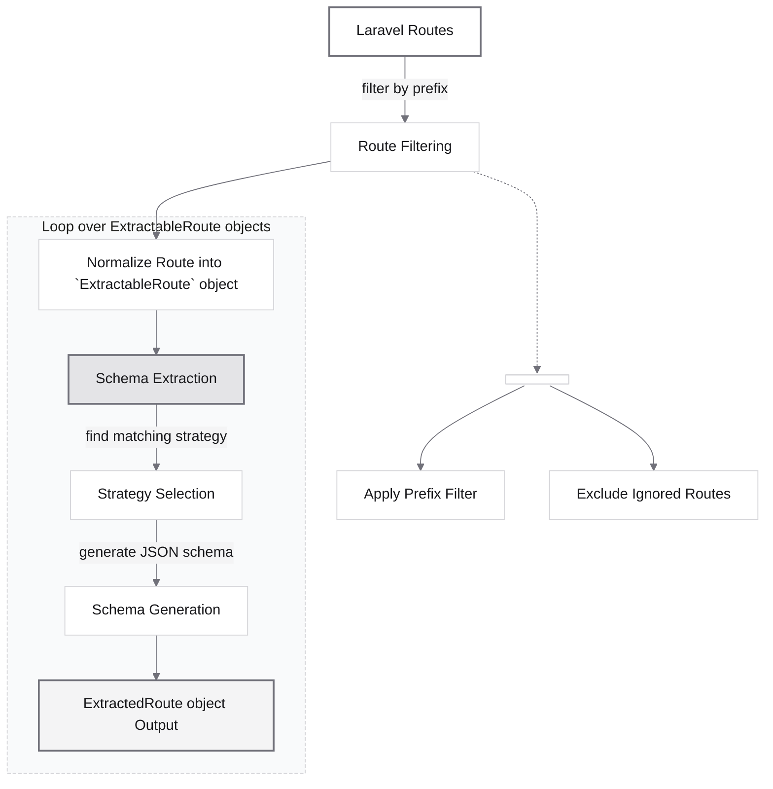
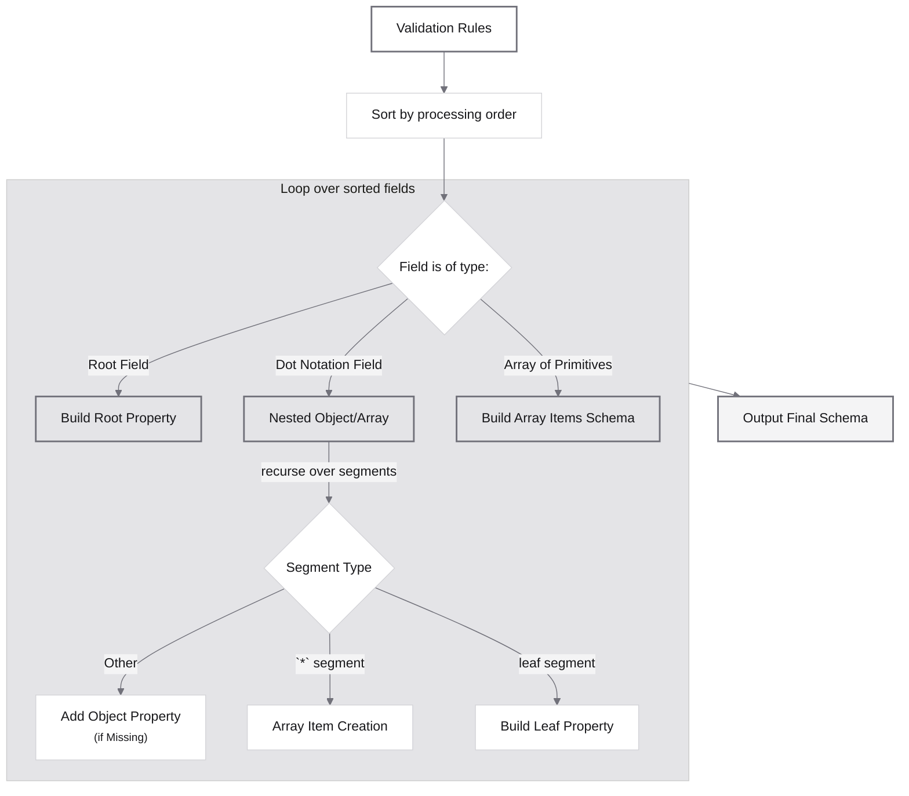
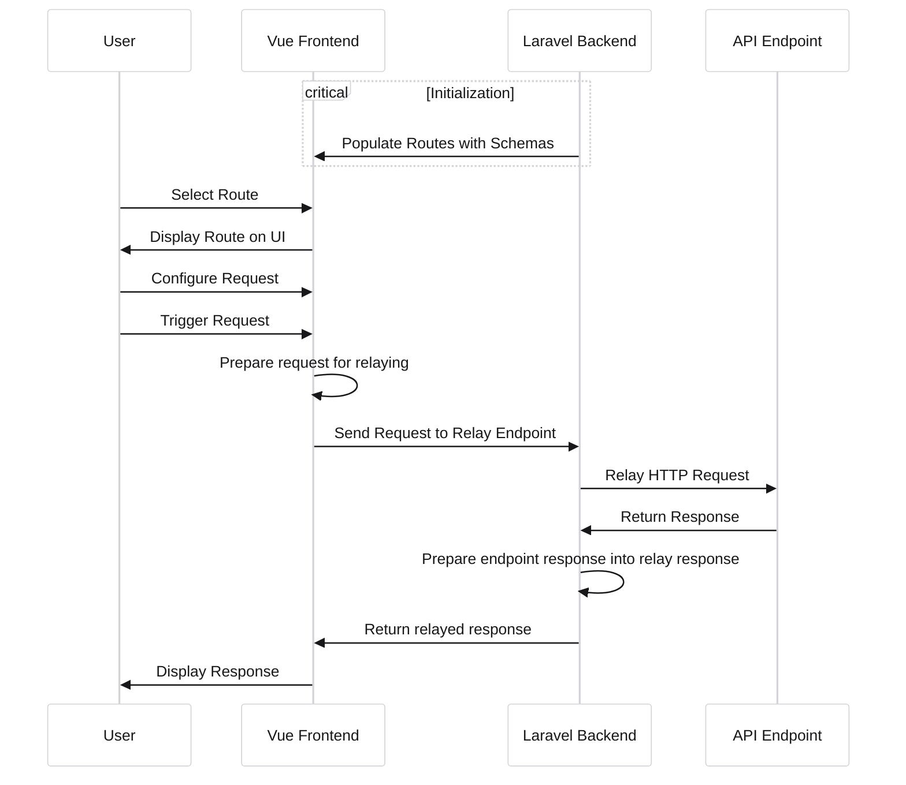

# Contributor Guide

Welcome to the Nimbus contributor guide. This document provides everything you need to understand Nimbus's architecture and contribute effectively.

---

## Table of Contents

**Understanding Nimbus**
- [Architecture Overview](#architecture-overview)
- [Core Concepts](#core-concepts)
- [Design Principles](#design-principles)

**Getting Started**
- [Development Environment Setup](#development-environment-setup)
- [Development Workflow](#development-workflow)
- [Testing Strategy](#testing-strategy)

**Contributing**
- [Contributing Process](#contributing-process)
- [Pull Request Guidelines](#pull-request-guidelines)

**Reference**
- [Coding Standards](#coding-standards)
- [Style Guides](#style-guides)
- [Architecture Rules](#architecture-rules)

---

## Architecture Overview

Nimbus follows a modular architecture that separates concerns into distinct, focused modules. The package automatically extracts validation schemas from Laravel routes and provides an interface for testing them.

### High-Level Architecture



### Module Structure

#### Backend Modules

```
src/
├── Commands/              # Artisan commands
├── Http/                  # Controllers and middleware
├── Intellisenses/         # TypeScript interface generation
└── Modules/               # Core business logic
    ├── Config/            # Configuration enums and constants
    ├── Routes/            # Route extraction and normalization
    ├── Schemas/           # Schema generation and transformation
    └── Relay/             # HTTP request relay and authorization
```

**Module responsibilities:**

- **Config** - Application configuration, enums, and constants.
- **Routes** - Extract and normalize Laravel routes and validation rules.
- **Schemas** - Transform validation rules into JSON schemas.
- **Relay** - Forward HTTP requests and handle authentication.
- **Intellisenses** - Generate TypeScript interfaces for backend entities.

#### Frontend Structure

```
resources/js/
├── app/                  # Application setup and initialization
├── components/           # Vue components
│   ├── base/             # Reusable UI components (buttons, inputs)
│   ├── common/           # Shared components (modals, dropdowns)
│   ├── domain/           # Business logic components (request builder)
│   └── layout/           # Layout components (panels, navigation)
├── composables/          # Vue composables (reactive logic)
├── stores/               # Pinia stores (global state)
├── utils/                # Utility functions
└── interfaces/           # TypeScript interfaces
```

---

## Core Concepts

### Route Extraction Process

The route extraction process analyzes Laravel routes and extracts normalized validation schemas.



**Key steps:**

1. **Route Filtering** - Filter routes by configured prefix, exclude ignored routes.
2. **Normalization** - Transform Laravel routes into `ExtractableRoute` objects.
3. **Strategy Selection** - Choose appropriate extraction strategy (Form Request vs inline validation).
4. **Schema Generation** - Convert validation rules to JSON schema.
5. **Output** - Produce `ExtractedRoute` objects with complete metadata.

### Schema Building Process

The schema builder converts Laravel validation rules into JSON Schema format with support for nested structures.



**Key concepts:**

- **Root fields** - Top-level properties (`name`, `email`).
- **Dot notation** - Nested structures (`user.profile.name`).
- **Array wildcards** - Array items (`items.*.name`).
- **Property building** - Convert validation rules to JSON Schema properties.
- **Recursive processing** - Handle deeply nested structures.

### Response Shape Extraction Process

The response shape extraction process resolves the JSON type structure of a route's response. It is triggered asynchronously when the user trigger the response shape download (from the response viewer tab).

#### Shape Extraction Strategies
The system uses the Strategy pattern to inspect the controller and extract the shape using static analysis:

1. **JsonResource Strategy** - Parses the controller return statement to identify Laravel extractable classes (like Spatie Data or JSON Resource).
2. **Raw JSON Response Strategy** - Parses the controller method body to find returned array literals or `response()->json(...)` calls. It infers types from literal values.
3. **Fallback Strategy** - Used if static analysis does not resolve the shape. It parses the actual response JSON body directly and maps types (string, number, boolean, object, array, null) to JSON Schema.

All schema properties built during the response shape extraction process are marked as required by default.

### Request Flow

How user interactions translate to API calls through the relay system.



---

## Design Principles

### Single Responsibility Principle

Each class has one clear purpose and reason to change.

**Examples:**

- `RouteExtractorService` - Orchestrates route extraction.
- `SchemaBuilder` - Converts validation rules to schemas.
- `RequestRelayAction` - Handles HTTP request forwarding.
- `PropertyBuilder` - Builds individual schema properties.

### Dependency Injection

Services are injected rather than instantiated directly.

```php
class RouteExtractorService
{
    public function __construct(
        protected SchemaExtractor $schemaExtractor,
        protected ExtractableRouteFactory $routeFactory,
        protected IgnoredRoutesService $ignoredRoutesService,
    ) {}
}
```

### Immutable Value Objects

Data structures don't change after creation, ensuring predictable behavior.

```php
readonly class ExtractedRoute
{
    public function __construct(
        public readonly Endpoint $uri,
        public readonly array $methods,
        public readonly Schema $schema,
    ) {}
}
```

### Strategy Pattern

Different algorithms encapsulated in separate classes for flexibility.

**Examples:**

- `FormRequestExtractorStrategy` - Extracts rules from Form Request classes.
- `InlineRequestValidatorExtractorStrategy` - Extracts inline validation.
- `BearerAuthorizationHandler` - Handles Bearer token auth.
- `CurrentUserAuthorizationHandler` - Handles session-based auth.

### Actions vs Services

The codebase distinguishes between **Actions** and **Services** based on their responsibilities.

#### Actions

**Definition:** A single, composable unit of work that performs one discrete operation.

**Characteristics:**
- Single responsibility - performs one complete operation.
- Composable - can be called by other actions, services, or controllers.
- Stateless - only holds dependencies, no internal mutable state.
- Returns results - produces DTOs, value objects, or collections.
- Workflow-oriented - may orchestrate multiple steps internally.

**Example:**
```php
class RequestRelayAction
{
    public function execute(RelayRequest $request): RelayResponse
    {
        // Performs one complete workflow: relay HTTP request
    }
}
```

#### Services

**Definition:** A reusable helper that encapsulates domain-specific logic or manages data.

**Characteristics:**
- Reusable logic - provides methods used by multiple actions or controllers.
- May hold state - if part of its responsibility.
- Non-orchestrating - it does not perform complete workflows.
- Domain/infrastructure focused - manages persistence, caching, configuration.

**Example:**
```php
class IgnoredRoutesService
{
    public function isIgnored(string $routeName): bool
    {
        // Provides reusable logic for route filtering
    }
}
```

#### Quick Comparison

| Feature | Action | Service                                 |
|---------|--------|-----------------------------------------|
| **Purpose** | Single unit of work / workflow | Reusable domain or infrastructure logic |
| **State** | Stateless beyond dependencies | Can hold state if necessary             |
| **Return** | Value, DTO, collection | Self, Side-effect, or data              |
| **Orchestration** | Can orchestrate multiple steps | Does not orchestrate                    |
| **Composable** | Yes | Usually used by actions or controllers  |

**Rule of Thumb:** If the class performs one discrete operation and returns a result, it's an **Action**. If the class provides reusable logic or manages state, it's a **Service**.

---

## Development Environment Setup

### Local Development Setup

#### 1. Clone the Package Repository

```bash
git clone https://github.com/sunchayn/nimbus.git
cd nimbus
composer install
npm install
```

#### 2. Clone the Development Repository

The dev repository provides a foundation for testing the package with a Laravel application.

```bash
git clone https://github.com/sunchayn/nimbus-dev.git
cd nimbus-dev
composer run setup
```

#### 3. Start a Web Server

**Important:** The relay endpoint requires a real web server by default. Using `php artisan serve` alone won't work out of the box (check [#3.1](#31-using-it-without-a-real-server) for instructions on how to make it work).

**Suggeted Options:**
- **Laravel Herd** - Recommended for macOS.
- **Laravel Sail** - Docker-based environment.
- **Valet** - Nginx-based for macOS.
- **Docker/Nginx/Apache** - Manual setup.

**Why not the built-in server?**

PHP's built-in server is single-threaded. When the relay endpoint makes a request back to the application, it creates a deadlock where the server waits for itself to respond.

#### 3.1. Using it without a real server

If you need to run Nimbus without a dedicated web server, you can still use php artisan serve with a two-server setup.

A. In the nimbus-dev directory, start the main development process:
```bash
composer dev
```

B. In a separate terminal tab (or windo), start another PHP server:
```bash
php artisan serve
```

C. Once both are running, open your config/nimbus.php file and set the routes.apiBaseUrl value to the URL of the second server (the one started with php artisan serve).

```php
// Example.
'apiBaseUrl' => 'http://127.0.0.1:8000',
```

#### 4. Run Frontend Development Server

```bash
# Inside nimbus directory
npm run dev
```

#### 5. Access Nimbus

Navigate to your Laravel application's Nimbus endpoint:

```
http://your-app.test/nimbus
```

### Testing Different Laravel Versions

Use Composer scripts to switch between Laravel versions:

```bash
# Switch to Laravel 10
composer run switch:l10

# Switch to Laravel 11
composer run switch:l11

# Switch to Laravel 12
composer run switch:l12
```

These scripts update `orchestra/testbench` and all related dependencies automatically.

After switching, run tests to verify compatibility:

```bash
composer test:parallel
```

---

## Development Workflow

### Code Organization

Follow the established module structure when adding new functionality.

**Backend modules:**

```
src/Modules/
├── Config/         # Add new configuration enums here
├── Routes/         # Route extraction and normalization logic
├── Schemas/        # Schema generation and transformation
└── Relay/          # HTTP relay and authorization handlers
```

**Frontend structure:**

```
resources/js/
├── components/
│   ├── base/       # Reusable UI components (buttons, inputs)
│   ├── common/     # Shared components (modals, notifications)
│   ├── domain/     # Business logic components (request builder)
│   └── layout/     # Layout components (panels, sidebar)
├── composables/    # Reactive stateful logic
├── stores/         # Global state management (Pinia)
└── utils/          # Pure utility functions
```

### Git Workflow

#### 1. Fork and Clone

```bash
git clone https://github.com/YOUR_USERNAME/nimbus.git
cd nimbus
git remote add upstream https://github.com/sunchayn/nimbus.git
```

#### 2. Create Feature Branch

```bash
git checkout -b feature/your-feature-name origin/base
```

Use descriptive branch names:
- `feature/add-openapi-support`
- `fix/schema-generation-nested-arrays`
- `refactor/extract-property-builder`

#### 3. Make Changes

- Follow coding standards (see [Coding Standards](#coding-standards)).
- Write tests for new functionality.
- Update documentation if needed.
- Keep commits focused and atomic.

#### 4. Test Your Changes

```bash
# Backend tests
composer test

# Frontend tests
npm run test:run

# Linting
composer style:fix
npm run style:fix
```

#### 5. Commit Changes

Use conventional commit messages:

```bash
git add .
git commit -m "feat(schemas): add support for nested array validation"
```

**Commit format:** `type(scope): description`

**Types:**
- `feat` - New feature.
- `fix` - Bug fix.
- `refactor` - Code restructuring.
- `docs` - Documentation changes.
- `test` - Adding tests.
- `chore` - Maintenance tasks.
- `build` - Dependencies or CI changes.

#### 5. Push and Create Pull Request

```bash
git push -u origin feature/your-feature-name
```

Then create a pull request on GitHub with:
- Clear description of changes.
- Reference to related issues.
- Screenshots for UI changes.
- Testing instructions.

---

## Testing Strategy

### Backend Testing

**Test organization:**
- Tests mirror the module structure.
- Each service has corresponding test classes.
- Integration tests verify end-to-end functionality.
- Unit tests focus on individual methods.

**Testing principles:**
- Test behavior, not implementation.
- Mock external dependencies.
- Use descriptive test names.
- Keep tests focused and independent.

**Running tests:**

```bash
# Run all tests
composer test

# Run tests in parallel (faster)
composer test:parallel

# Run with coverage
composer test:coverage

# Run specific test class
composer test -- --filter SchemaBuilderTest

# Run specific test method
composer test -- --filter testBuildsSchemaFromValidationRules
```

**Test example:**

```php
class SchemaBuilderUnitTest extends TestCase
{
    public function test_it_builds_schema_for_simple_validation_rules(): void
    {
        // Arrange
        
        $rules = [
            'name' => ['required', 'string', 'max:255'],
            'email' => ['required', 'email'],
            'age' => ['integer', 'min:18'],
        ];

        // Act
        
        $schema = $this->schemaBuilder->build($rules);

        // Assert
        
        $this->assertArrayHasKey('name', $schema['properties']);
        $this->assertEquals('string', $schema['properties']['name']['type']);
        $this->assertTrue($schema['properties']['name']['required']);
    }
}
```

### Frontend Testing

**Component testing guidelines:**
- Test user interactions and outcomes.
- Mock external dependencies (API calls, stores).
- Use `data-testid` attributes for selectors.
- Focus on component behavior, not implementation details.

**Linting and formatting:**

```bash
# Check styling issues
npm run style:check

# Automatically fix styling issues
npm run style:fix
```

**Running component tests:**

```bash
# Run all tests
npm run test:run

# Run tests in watch mode
npm run test

# Run specific test file
npm run test:run -- RequestBuilder.test.ts
```

**Test example:**

```typescript
import { mount } from '@vue/test-utils'
import { describe, it, expect } from 'vitest'
import RequestBuilder from '@/components/domain/RequestBuilder.vue'

describe('RequestBuilder', () => {
  it('validates required fields', async () => {
    const wrapper = mount(RequestBuilder, {
      props: {
        schema: {
          properties: {
            name: { type: 'string', required: true }
          }
        }
      }
    })

    // Trigger validation
    await wrapper.find('[data-testid="submit-btn"]').trigger('click')

    // Assert error message appears
    expect(wrapper.find('[data-testid="error-message"]').text())
      .toContain('name is required')
  })
})
```

---

## Contributing Process

### Before You Start

1. **Check existing issues** - Someone may already be working on it.
2. **Open an issue first** - For major changes, discuss the approach.
3. **Read the documentation** - Understand the architecture and patterns.
4. **Set up your environment** - Follow the setup guide above.

### Development Process

Follow the [Git Workflow](#git-workflow) guide.

#### Update Documentation

If your changes affect:
- **User-facing features** → Update User Guide
- **Architecture or patterns** → Update Contributor Guide
- **Configuration** → Update config comments and README

#### Submit Pull Request

**PR title format:** `type(scope): brief description`

**PR description should include:**
- What changes were made.
- Why the changes were necessary.
- How to test the changes.
- Screenshots for UI changes.
- Related issues (e.g., "Closes #123").

**Example PR description:**

```markdown
## Description
Adds support for extracting validation rules from custom validation rule objects.

## Motivation
Currently, Nimbus only supports array-based validation rules. Many Laravel apps use custom rule objects, which are not extracted.

## Changes
- Added `RuleObjectExtractor` to handle custom rule objects
- Updated `SchemaExtractor` to detect and use the new extractor
- Added tests for rule object extraction

## Testing
1. Create a route with custom rule object validation
2. Access Nimbus interface
3. Verify the route appears with correct schema

Closes #42
```

### Pull Request Guidelines

#### Code Review Checklist

Before submitting, verify:

- [ ] Code follows established patterns and conventions.
- [ ] All tests pass.
- [ ] New functionality has test coverage.
- [ ] Documentation is updated.
- [ ] No linting or formatting errors.
- [ ] Commits are clean and well-described.
- [ ] PR description is clear and complete.

#### What Reviewers Look For

**Code quality:**
- Follows SOLID principles.
- Appropriate use of Actions vs Services.
- Proper dependency injection.
- Clear, descriptive naming.

**Testing:**
- Adequate test coverage.
- Tests focus on behavior, not implementation.
- Edge cases are considered.
- Tests are independent and repeatable.

**Documentation:**
- Code is self-documenting where possible.
- Complex logic has explanatory comments.
- User-facing changes documented in User Guide.
- Architecture changes documented in Contributor Guide.

**Performance:**
- No obvious performance issues.
- Efficient algorithms and data structures.
- Appropriate use of caching.

**Breaking changes:**
- Clearly documented.
- Migration path provided if applicable.
- Version bump follows semantic versioning.

---

## Coding Standards

### PHP Coding Standards

#### Method Naming

Use action-oriented, domain-specific names that clearly communicate intent.

**Good examples:**

```php
// Action-oriented + domain-specific
public function switchToRouteDefinitionOf(string $method): void
public function initializeRequest(Route $route, array $availableRoutes): void
public function executeCurrentRequest(): void
public function validateUserPreferences(array $data): bool
public function generateCurlCommand(Request $request): string
```

**Poor examples:**

```php
// Implementation-focused, unclear intent
public function updateSchemaAndPayloadForMethod(string $method): void
public function setupRequestData(Route $route, array $routes): void
public function processRequest(): void
public function doValidation(array $data): bool
```

#### Type Declarations

Always use type declarations for parameters and return types.

```php
// Good
public function buildSchema(array $rules): array
{
    // Implementation
}

// Bad
public function buildSchema($rules)
{
    // Implementation
}
```

#### Readonly Properties

Use readonly properties for immutable data.

```php
readonly class ExtractedRoute
{
    public function __construct(
        public readonly Endpoint $uri,
        public readonly array $methods,
        public readonly Schema $schema,
    ) {}
}
```

### Vue.js Coding Standards

#### Composition API

Always use `<script setup>` with TypeScript.

```vue
<script setup lang="ts">
import { ref, computed } from 'vue'

// Props
const props = defineProps<{
  title: string
  items: Item[]
}>()

// Emits
const emit = defineEmits<{
  update: [value: string]
}>()

// State
const isLoading = ref(false)

// Computed
const filteredItems = computed(() => {
  return props.items.filter(item => item.active)
})

// Methods
const handleUpdate = (value: string) => {
  emit('update', value)
}
</script>

<template>
  <!-- Template content -->
</template>
```

#### Component Structure Order

Organize component code in this order:

1. Imports.
2. Props and emits.
3. Reactive state (ref, reactive).
4. Computed properties.
5. Methods/functions.
6. Lifecycle hooks.
7. Watch statements.

#### TypeScript Usage

- Use strict type checking.
- Define interfaces for complex objects.
- Avoid `any` type.
- Use type assertions sparingly.

```typescript
// Good - explicit types
interface RequestConfig {
  method: string
  url: string
  headers: Record<string, string>
  body?: unknown
}

const config: RequestConfig = {
  method: 'POST',
  url: '/api/users',
  headers: { 'Content-Type': 'application/json' }
}

// Bad - any type
const config: any = { /* ... */ }
```

---

## Style Guides

### Comment Style Guide

#### Docblock Format

Use docblocks to explain purpose and business context, not implementation.

```php
/**
 * Builds a JSON Schema from Laravel validation rules.
 *
 * This method handles nested structures using dot notation and array wildcards.
 * It processes fields in a specific order to ensure parent objects exist before
 * child properties are added.
 * 
 * @param array<string, array<int, string|object>> $rules Laravel validation rules
 * @return array<string, mixed> JSON Schema representation
 */
public function build(array $rules): array
{
    // Implementation
}
```

#### Inline Comments

Explain **why** decisions were made, not **what** the code does.

```php
// Good - explains reasoning
// Process parent fields first to ensure nested objects exist
$sortedFields = $this->sortFieldsByDepth($fields);

// Bad - restates the obvious
// Loop through the fields
foreach ($fields as $field) {
    // ...
}
```

#### TODO Comments

Use categorized TODO comments for future work.

```php
// TODO [Feature]: Add support for custom validation rule objects
// TODO [Enhancement]: Cache compiled schemas for better performance
// TODO [Bug]: Fix handling of conditional validation rules
// TODO [Refactor]: Extract cookie decryption into dedicated service
// TODO [Performance]: Optimize schema generation for large rule sets
// TODO [Documentation]: Add examples for complex nested structures
// TODO [Test]: Add integration tests for authentication flow
```

**Allowed categories:**

| Category | Purpose | Example |
|----------|---------|---------|
| **Feature** | New functionality planned | Investigate supporting Closures for route extraction |
| **Enhancement** | Improvement to existing functionality | Convert logged-in user to bearer token |
| **Bug** | Known defect that needs fixing | Implement impersonation logic properly |
| **Refactor** | Code reorganization needed | Extract cookie creation into service |
| **Performance** | Optimization opportunity | Cache authorization handlers |
| **Documentation** | Missing or incomplete docs | Add examples for custom auth strategies |
| **Test** | Missing or incomplete test coverage | Add integration tests for relay flow |

### Tailwind CSS Usage

#### Use Utility Classes Only

Use Tailwind's utility classes exclusively. Avoid custom CSS when possible.

```vue
<!-- Good - Tailwind utilities -->
<div class="flex h-screen max-h-screen overflow-hidden">
  <div class="bg-white border-r border-zinc-200 p-4">
    <h2 class="text-lg font-semibold text-zinc-900 mb-4">Routes</h2>
  </div>
</div>

<!-- Bad - custom CSS -->
<div class="custom-layout">
  <div class="sidebar">
    <h2 class="sidebar-title">Routes</h2>
  </div>
</div>

<style>
.custom-layout { /* ... */ }
.sidebar { /* ... */ }
</style>
```

#### Component Class Extraction

For repeated patterns, extract to component props or composables, not CSS classes.

```vue
<script setup lang="ts">
const buttonClasses = computed(() => ({
  base: 'px-4 py-2 rounded font-medium transition-colors',
  primary: 'bg-blue-600 hover:bg-blue-700 text-white',
  secondary: 'bg-gray-200 hover:bg-gray-300 text-gray-900'
}))
</script>
```

---

## Architecture Rules

### Backend Architecture Rules

#### Controllers

Controllers orchestrate, they don't contain business logic.

```php
// Good - controller delegates to action
class RelayController extends Controller
{
    public function __construct(
        private RequestRelayAction $relayAction
    ) {}

    public function relay(Request $request): JsonResponse
    {
        $relayRequest = RelayRequest::fromRequest($request);
        $relayResponse = $this->relayAction->execute($relayRequest);
        
        return response()->json($relayResponse);
    }
}

// Bad - controller contains business logic
class RelayController extends Controller
{
    public function relay(Request $request): JsonResponse
    {
        // Complex logic here
        $client = new Client();
        $response = $client->request(/* ... */);
        // More logic...
        
        return response()->json($data);
    }
}
```

#### Services

Services handle single business concerns and use dependency injection.

```php
class SchemaExtractorService
{
    public function __construct(
        private FormRequestExtractorStrategy $formRequestStrategy,
        private InlineRequestValidatorExtractorStrategy $inlineStrategy,
    ) {}

    public function extract(ExtractableRoute $route): ?array
    {
        // Single responsibility: extract validation rules
        // Delegates to appropriate strategy
    }
}
```

#### Value Objects and DTOs

Use immutable value objects and DTOs for data transfer and manipulation.

```php
// Immutable value object
readonly class RelayRequest
{
    public function __construct(
        public string $method,
        public string $url,
        public array $headers,
        public ?array $body,
        public ?AuthorizationType $authorization,
    ) {}
    
    public static function fromRequest(Request $request): self
    {
        return new self(
            method: $request->input('method'),
            url: $request->input('url'),
            headers: $request->input('headers', []),
            body: $request->input('body'),
            authorization: AuthorizationType::tryFrom($request->input('authorization.type')),
        );
    }
}
```

### Frontend Architecture Rules

#### Component Organization

Group related code together and keep components focused.

```vue
<script setup lang="ts">
// 1. Imports
import { ref, computed, onMounted } from 'vue'
import { useRequestStore } from '@/stores/request'

// 2. Props and emits
const props = defineProps<{
  route: Route
}>()

const emit = defineEmits<{
  submit: [request: RequestConfig]
}>()

// 3. Stores and composables
const requestStore = useRequestStore()
const { validatePayload } = useValidation()

// 4. Reactive state
const payload = ref<Record<string, unknown>>({})
const errors = ref<ValidationError[]>([])

// 5. Computed properties
const isValid = computed(() => errors.value.length === 0)

// 6. Methods
const handleSubmit = () => {
  errors.value = validatePayload(payload.value)
  if (isValid.value) {
    emit('submit', { ...payload.value })
  }
}

// 7. Lifecycle hooks
onMounted(() => {
  // Initialize
})
</script>
```

#### State Management

Use appropriate state management strategies:

- **Local state** - Component-specific data.
- **Composables** - Reusable reactive logic.
- **Pinia stores** - Global application state.

```typescript
// Composable for reusable reactive logic
export function useValidation(schema: Schema) {
  const errors = ref<ValidationError[]>([])
  
  const validate = (data: unknown): boolean => {
    errors.value = performValidation(data, schema)
    return errors.value.length === 0
  }
  
  return {
    errors: readonly(errors),
    validate
  }
}

// Store for global state
export const useRequestStore = defineStore('request', () => {
  const currentRequest = ref<RequestConfig | null>(null)
  const history = ref<RequestConfig[]>([])
  
  const setCurrentRequest = (request: RequestConfig) => {
    currentRequest.value = request
    history.value.push(request)
  }
  
  return {
    currentRequest,
    history,
    setCurrentRequest
  }
})
```

---

## Final Notes

### Continuous Improvement

The codebase has undergone multiple refactoring rounds. Some inconsistencies or confusing parts may exist and will be addressed as the project matures.

### Getting Help

- **Architecture questions** - Open a discussion on GitHub.
- **Bug reports** - Open an issue with reproduction steps.
- **Feature proposals** - Start a discussion first to align on approach.

---

### Thank You
