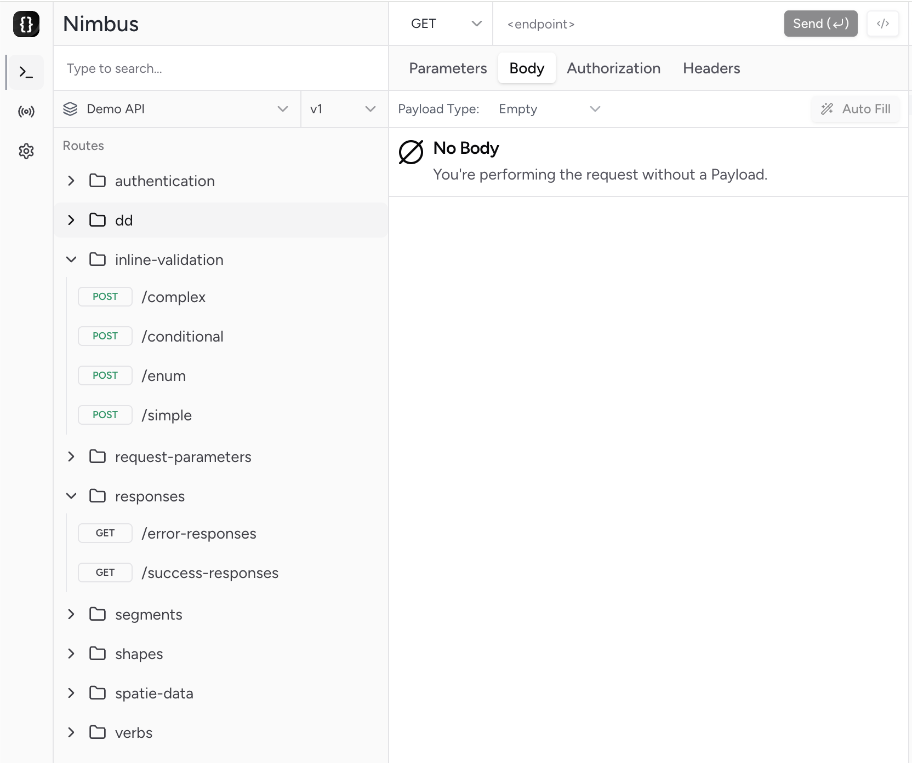
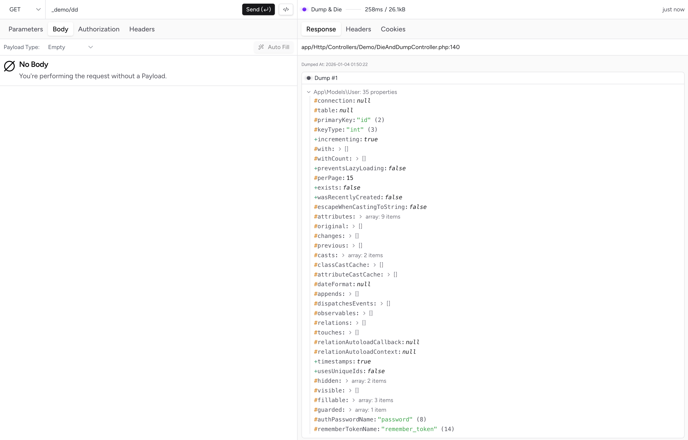
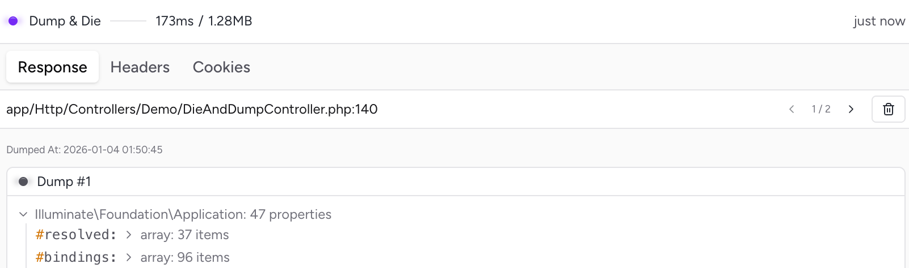
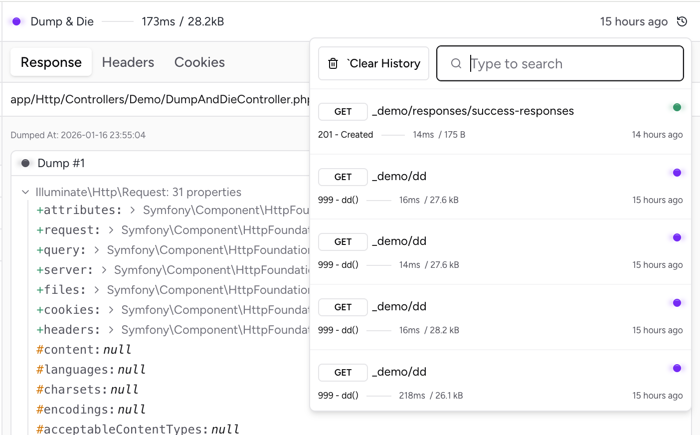
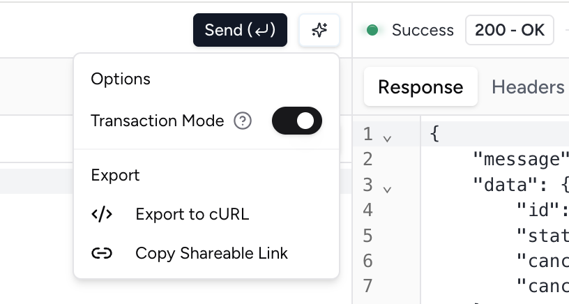
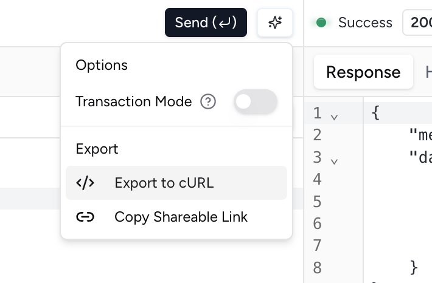
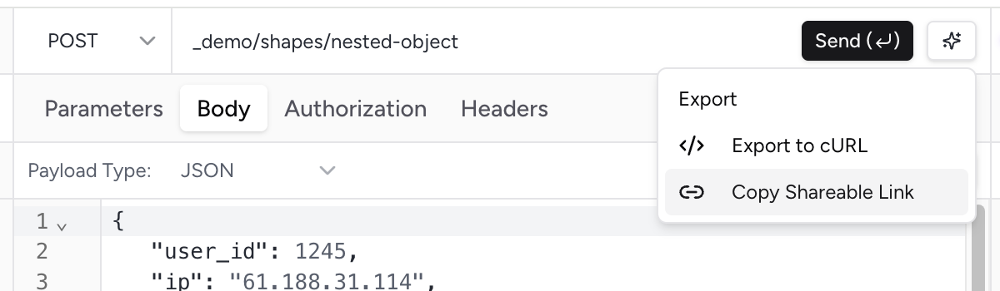
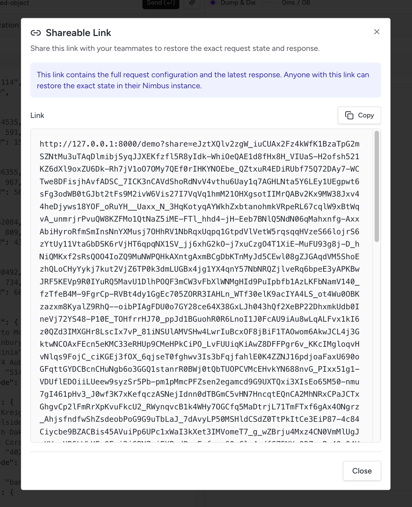
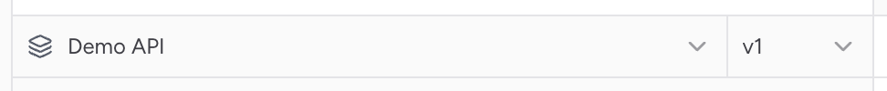

# User Guide

**Nimbus** - An integrated, in-browser API client for Laravel with automatic schema discovery.

This guide covers everything you need to know about using Nimbus to test and explore your Laravel APIs.

---

## Table of Contents

- [Getting Started](#getting-started)
    - [Installation](#installation)
    - [Accessing Nimbus](#accessing-nimbus)
    - [Interface Overview](#interface-overview)
- [Using Nimbus](#using-nimbus)
    - [Route Explorer](#route-explorer)
    - [Request Builder](#request-builder)
    - [Response Viewer](#response-viewer)
        - [Cookie Inspection](#cookie-inspection)
        - [Dump and Die Responses](#dump-and-die-responses)
        - [Request History](#request-history)
- [Authentication](#authentication)
    - [Session-Based Authentication](#session-based-authentication)
    - [Bearer Tokens](#bearer-tokens)
    - [Basic Auth](#basic-auth)
    - [User Impersonation](#user-impersonation)
- [Advanced Features](#advanced-features)
    - [Global Headers](#global-headers)
    - [Value Generators](#value-generators)
    - [Auto-Fill Payloads](#auto-fill-payloads)
    - [Transaction Mode](#transaction-mode)
    - [Export to cURL](#export-to-curl)
    - [Shareable Links](#shareable-links)
- [Configuration](#configuration)
- [Troubleshooting](#troubleshooting)
- [Getting Help](#getting-help)

---

## Getting Started

### Installation

#### Requirements

- PHP 8.2 or higher.
- Laravel 10.x, 11.x, or 12.x.

#### Install via Composer

```bash
composer require sunchayn/nimbus
```

#### Publish Configuration and Assets

```bash
php artisan vendor:publish --tag=nimbus-assets --tag=nimbus-config
```

This publishes:
- `config/nimbus.php` - Configuration file
- Frontend assets required for the interface

### Accessing Nimbus

Once installed, start your Laravel application using a real web server (Herd, Sail, Docker, Nginx, etc.) and navigate to:

```
http://your-app.test/nimbus
```

**Important**: Do not use PHP's built-in server (`php artisan serve`). The relay endpoint requires a web server that can handle concurrent requests.

### Interface Overview

The Nimbus interface consists of three main panels:


1. **Route Explorer** (left) - Browse and select API routes.
2. **Request Builder** (center) - Configure and send requests.
3. **Response Viewer** (right) - View responses and details.

---

## Using Nimbus

### Route Explorer

The Route Explorer automatically discovers your Laravel API routes and organizes them by resource.



**Features:**
- **Search**: Quickly filter routes by endpoint path.
- **Application Switcher**: Switch between multiple API applications (e.g., Rest API, CMS API) if configured.
- **Version Selector**: If the active application is versioned, a version picker appears inline with the application name.
- **Resource Groups**: Routes are automatically grouped by resource (e.g., `users`, `products`).
- **HTTP Methods**: Each route explicitly shows its supported methods.
- **Quick Load**: Click any route to immediately load it into the Request Builder.

### Request Builder

The Request Builder provides an intuitive interface for configuring API requests.


#### Components

**Method Selection**
- HTTP method is automatically set from the route.
- The methods supported by the route are groupped together in the list.

**URL Parameters**
- Add query string parameters.
- Real-time URL preview.

**Headers**
- Add custom headers.
- Global headers automatically included.

**Request Body**
- JSON editor with syntax highlighting.
- Schema validation based on Laravel validation rules.
- Real-time validation feedback.

**Authorization**
- Multiple authentication methods.
- See [Authentication](#authentication) section for details.

#### Schema-Aware Editing

Nimbus analyzes your Laravel validation rules to provide intelligent editing:


**Validation Features:**
- Required fields are highlighted.
- Field types are enforced (string, number, boolean, etc.).
- Validation errors shown in real-time.
- Nested object and array support.

#### Auto-Fill Payloads

Populate entire request payloads with realistic test data.


**How it works:**
1. Click the "Auto Fill" button.
2. Nimbus generates values based on validation rules and field names.
3. Review and modify generated values as needed.

**Smart Generation:**
Field names are cross-checked against a pre-defined set of patterns, common names will get an adequate generated value that cannot normally be inferred from a validation rule (e.g., the address fields from the example above):
- `email` fields → realistic email addresses
- `password` fields → secure random passwords
- `uuid` fields → valid UUIDs
- `date` fields → properly formatted dates
- Numeric fields → values within min/max constraints

### Response Viewer

The Response Viewer displays detailed information about API responses.


**Displayed Information:**
- HTTP status code with description.
- Response time in milliseconds.
- Complete response headers.
- Formatted response body with syntax highlighting.
- Cookie information (see [Cookie Inspection](#cookie-inspection)).

**Features:**
- Collapsible sections for better organization.
- Copy response body to clipboard.
- Pretty-printed JSON for readability.

#### Cookie Inspection

View and decrypt Laravel session cookies with ease.


**Raw Cookies:**
The raw values as observed in the `Set-Cookie` headers from the response.


**Decrypted Cookies:**
Automatic decryption of Laravel encrypted cookies.

#### Dump and Die Responses

When a `dd()` response is detected. Nimbus will switch to a rich `dd` response viewer where you can navigate the dump(s) as a JSON object.



You can also see the file name and line shown under the tabs (e.g. `app/Http/Controllers/Demo/DumpAndDieController.php:140
`) which is the source that made these dumps.

_Note: dumps are only sticky for connectives `dd` responses, having a non-`dd` response will earse the history._

##### Dumps withing the same debug window

When keep sending `dd` responses, the previous values can still be accessed via pagination. You can always delete the unwanted ones.



#### Request History

Nimbus keeps a log of every request you send, allowing you to quickly "rewind" to a previous state.



**Features:**
- **Automatic Logging**: Every execution is recorded with its timestamp, request details, and response status.
- **Searchable Logs**: Use the search bar within the history dropdown to filter by endpoint path.
- **Full Restoration**: Clicking any history item will restore the **entire Request Builder state**, including:
    - HTTP Method and Endpoint
    - Headers and Query Parameters
    - Request Body & Payload Type
    - Authentication settings
- **Persistent Session**: Your history is preserved across page refreshes.

**How to use:**
1. Click on the relative timestamp (e.g., "5 minutes ago") next to the response status badge.
2. Browse or search through your previous requests.
3. Click a log entry to restore its state into the Request Builder.
4. Use the "Clear History" button to purge your session logs.

---

## Authentication

Nimbus supports multiple authentication methods for testing protected endpoints.


### Session-Based Authentication

**Current User Session** allows you to make requests as the currently logged-in user from your main application.

**How it works:**
1. Log into your Laravel application in another tab.
2. Select "Current User Session" in Nimbus.
3. Requests will include your session cookies.

### Bearer Tokens

Standard Bearer token authentication for API endpoints.

**Use case:** Testing JWT or Sanctum token-protected endpoints.

**How to use:**
1. Select "Bearer" from authentication options.
2. Enter your access token.
3. Token is sent in `Authorization: Bearer {token}` header.

### Basic Auth

HTTP Basic Authentication with username and password.

**Use case:** Testing endpoints protected with Basic Auth.

**How to use:**
1. Select "Basic" from authentication options.
2. Enter username and password.
3. Credentials are base64-encoded and sent in `Authorization` header.

### User Impersonation

Make requests as any user in your system using their user ID.

**Use case:** Testing how endpoints behave for different users without logging in as them.

**How it works:**
1. Select "Impersonate" from authentication options.
2. Enter the user ID.
3. Nimbus authenticates the request as that user.

---

## Advanced Features

### Global Headers

Configure headers that are automatically included in every request.

**Configuration:**

Edit `config/nimbus.php`:

```php
'headers' => [
    'x-api-version' => '1.0',
    'x-request-id' => \Sunchayn\Nimbus\Modules\Config\GlobalHeaderGeneratorTypeEnum::Uuid,
    'x-session-id' => \Sunchayn\Nimbus\Modules\Config\GlobalHeaderGeneratorTypeEnum::Uuid,
    'host' => 'example.com',
],
```

**Dynamic Values:**

Use `GlobalHeaderGeneratorTypeEnum` for randomly generated values, for example:
- `Uuid` - Generate a UUID for each request
- Additional generators available in the enum

**Use cases:**
- API versioning headers.
- Request tracking IDs.
- Custom authentication keys.
- Host headers for multi-tenant apps.

### Value Generators

Generate realistic values for headers and parameters on-demand.


**How to use:**
1. Focus on a value input field.
2. Click the generator icon (or press Shift twice).
3. Select the type of value to generate.
4. Press Enter or click on the generator to insert.

**Available generators:**
- UUIDs.
- Email addresses.
- Names (first, last, full).
- Dates (various formats).
- Phone numbers.
- URLs.
- URLs.
- And more...

### Transaction Mode

Transaction Mode allows you to execute requests without affecting your database. This is particularly useful for testing destructive operations (like creating, updating, or deleting records) without having to manually clean up your test data.

**How it works:**
1. Click the **Request Options** (sparkles) icon in the endpoint bar.
2. Toggle **Transaction Mode** to **ON**.
3. Execute your request.
4. Nimbus wraps the entire request in a database transaction and automatically rolls it back once the request is complete.



**Note:** Only database operations are rolled back. External side effects like sending emails, making external API calls, or file system changes will still occur.

### Export to cURL

Export configured requests as cURL commands for use in terminals or scripts.



**How to export:**
1. Configure your request completely
2. Click the export button
3. Copy the generated cURL command


**What's included:**
- Full URL with parameters
- All headers (including global headers)
- Authentication credentials
- Request body
- HTTP method

### Shareable Links

Shareable links allow you to capture the exact state of your Request Builder and share it with others. This is perfect for bug reports, API demonstrations, or collaborating on complex request configurations.

**Capture everything:**
- HTTP Method and Endpoint
- Headers and Query Parameters
- Request Body & Payload Type
- Authentication settings
- Last response metadata (status, duration, and size)

**How to use:**
1. Configure your request (and optionally execute it to include response context).
2. Click the **Request Options** (sparkles) icon in the endpoint bar.
3. Select **Copy Shareable Link**.
4. Share the generated URL.





**Automatic Restoration:**
When a shareable link is opened, Nimbus will:
- Parse and decompress the payload.
- Automatically restore all request data.
- **Switch Applications**: If the link points to a route in a different application (e.g., from `Rest API` to `Admin API`), Nimbus will automatically switch the active application context for you.

---

## Configuration

The `config/nimbus.php` file provides customization options:

```php
return [

    'prefix' => 'nimbus',

    'allowed_envs' => ['local', 'staging'],

    'routes' => [
        'prefix' => 'api',
        'versioned' => false,
    ],

    'auth' => [
        'guard' => 'web',
        'special' => [
            'injector' => \Sunchayn\Nimbus\Modules\Relay\Authorization\Injectors\RememberMeCookieInjector::class,
        ],
    ],

    'headers' => [],
];
```

### Configuration Options

| Option                                     | Description                                                                                                                                                                                                     | Default                           | Example                                                   |
|--------------------------------------------|-----------------------------------------------------------------------------------------------------------------------------------------------------------------------------------------------------------------|-----------------------------------|-----------------------------------------------------------|
| **`prefix`**                               | The URI segment under which Nimbus is accessible.                                                                                                                                                               | `'nimbus'`                        | `'api-client'`                                            |
| **`allowed_envs`**                         | Environments where Nimbus is enabled. Avoid production for security reasons.                                                                                                                                    | `['local', 'staging']`            | `['testing', 'local']`                                    |
| **`default_application`**                   | The base default application to load when no other application is found in the storage.                                                                                                                         | n/a                               | `rest-api`                                                |
| **`applications.*.routes.prefix`**         | The base path used to detect application routes. Only routes starting with this prefix are analyzed.                                                                                                            | `'api'`                           | `'api/v1'`                                                |
| **`applications.*.routes.versioned`**      | Enables version parsing for routes like `/api/v1/...`.                                                                                                                                                          | `false`                           | `true`                                                    |
| **`applications.*.routes.api_base_url`**   | The base URL used when Nimbus relays API requests from the UI. Useful when the API runs on a different domain or port. If set to null, Nimbus will default to the same host and scheme as the incoming request. | null                              | `http://127.0.0.1:8001`                                   |
| **`applications.*.auth.guard`**            | The Laravel guard used for the API requests authentication.                                                                                                                                                     | `'api'`                           | `'web'`                                                   |
| **`applications.*.auth.special.injector`** | Injector class used to attach authentication credentials to outgoing requests. Must implement `SpecialAuthenticationInjectorContract`.                                                                          | `RememberMeCookieInjector::class` | `TymonJwtTokenInjector::class`                            |
| **`headers`**                              | Global headers applied to all outgoing requests. Supports static values or enum generators.                                                                                                                     | `[]`                              | `['x-request-id' => GlobalHeaderGeneratorTypeEnum::UUID]` |

### Multi-Application Support

Nimbus allows you to define multiple distinct application in your configuration. This is ideal for projects with multiple APIs like a REST api + CMS APIs, or different microservices within the same monolith.

```php
'applications' => [
    'main' => [
        'name' => 'Public API',
        'routes' => [
            'prefix' => 'api/v1',
            'versioned' => false,
        ],
    ],
    'admin' => [
        'name' => 'Admin API',
        'routes' => [
            'prefix' => 'api/admin',
            'versioned' => true,
        ],
    ],
],
```

When multiple applications are defined, a Project Switcher appears in the sidebar, allowing you to quickly toggle between them.



#### Special Authentication Modes

Nimbus comes with two authentication injection strategies:

| Mode | Injector Class | Description |
|------|----------------|-------------|
| **RememberMe Cookie** | `RememberMeCookieInjector::class` | Authenticates using Laravel's remember-me cookie for the current session. |
| **JWT Token** | `TymonJwtTokenInjector::class` | Injects a bearer token for JWT-authenticated APIs. |

Custom injectors can be implemented by extending:

```php
Sunchayn\Nimbus\Modules\Relay\Authorization\Contracts\SpecialAuthenticationInjectorContract
```

#### Versioned Routes

If your routes are versioned (e.g. `/api/v1/users`), set `routes.versioned` to `true`.  
Nimbus will automatically extract and display version segments when generating schema representations.

## Troubleshooting

### Routes Not Appearing

**Problem:** Your API routes don't show up in the Route Explorer.

**Solutions:**

1. **Check route prefix configuration**
    - Verify `routes.prefix` in `config/nimbus.php` matches your API routes.
    - Default is `api`, so routes should start with `/api/`.

2. **Clear route cache**
   ```bash
   php artisan route:clear
   ```

3. **Verify route registration**
    - Ensure routes are in `routes/api.php`.
    - Check `RouteServiceProvider` (Laravel 10-11) or `bootstrap/app.php` (Laravel 12+).

### Interface Not Loading

**Problem:** The Nimbus interface shows errors or doesn't load.

**Solutions:**

1. **Re-publish assets**
   ```bash
   php artisan vendor:publish --tag=nimbus-assets --force
   ```

2. **Clear all caches**
   ```bash
   php artisan cache:clear
   php artisan config:clear
   php artisan view:clear
   ```

3. **Check browser console**
    - Open developer tools.
    - Look for JavaScript errors.
    - Check for failed asset requests.

### Relay Endpoint Not Working

**Problem:** Requests hang or fail when sent from Nimbus.

**Solutions:**

1. **Use a proper web server**
    - Do NOT use `php artisan serve`.
    - Use Herd, Sail, Docker, Nginx, or Apache.
    - The built-in PHP server cannot handle concurrent requests.

2. **Check application URL**
    - Verify `APP_URL` in `.env` is correct.
    - Ensure it matches your actual domain.

### Authentication Issues

**Problem:** Authenticated requests fail or return unauthorized errors.

**Solutions:**

1. **Session authentication**
    - Ensure you're logged into the main app.
    - Check that session cookies are being sent.
    - Verify session driver configuration.

2. **Bearer tokens**
    - Verify token is valid and not expired.
    - Check token format (no extra spaces).
    - Ensure API expects Bearer authentication.

3. **User impersonation**
    - Verify the user ID exists in your database.
    - Check that user model is correctly configured.

### Schema Validation Errors

**Problem:** Valid payloads show validation errors in the editor.

**Solutions:**

1. **Check validation rules**
    - Ensure Form Request rules are correct
    - Verify inline validation syntax

2. **Nested structures**
    - Use proper dot notation (`user.profile.name`)
    - Arrays should use `*` notation (`items.*.name`)

3. **Re-publish config**
   ```bash
   php artisan vendor:publish --tag=nimbus-config --force
   ```

---

## Getting Help

### Documentation

- **GitHub Repository**: [https://github.com/sunchayn/nimbus](https://github.com/sunchayn/nimbus)
- [**Contributor Guide**](../contribution-guide/README.md): Architecture and development details.

### Support Channels

- **Bug Reports**: [Open an issue](https://github.com/sunchayn/nimbus/issues/new/choose)
- **Feature Requests**: [Share your ideas](https://github.com/sunchayn/nimbus/discussions/categories/ideas)
- **Questions**: [Ask in discussions](https://github.com/sunchayn/nimbus/discussions/categories/q-a)

### Before Asking for Help

1. Check this troubleshooting section.
2. Search existing GitHub issues.
3. Verify your Laravel and PHP versions meet requirements.
4. Try clearing all caches.
5. Check the browser console for JavaScript errors.

When reporting issues, include:
- Laravel version.
- PHP version.
- Nimbus version.
- Error messages or screenshots.
- Steps to reproduce the problem (you can fork the [dev repository](https://github.com/sunchayn/nimbus-dev) if needed).
